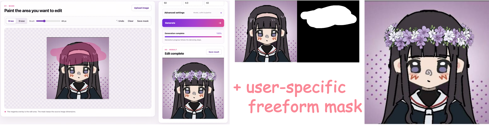

# 🌊 MaskFlow: Precise, Consistent and Seamless Regional Image Editing

<p align="center">
  <a href="https://reychiaro.github.io/MaskFlow"></a>
  <a href="https://arxiv.org/abs/2608.06929"></a>
  <a href="https://github.com/ReyChiaro/MaskFlow"></a>
  <a href="https://huggingface.co/ReyChiaro/MaskFlow"></a>
  <a href="https://huggingface.co/datasets/ReyChiaro/MaskEdit-10k"></a>
  <a href="https://github.com/ModelTC/LightX2V"></a>
</p>

> ## Overview
> 🌊 <u>**Models**</u>: This repository is the official implementation for paper "MaskFlow: Precise, Consistent and Seamless Regional Image Editing", including:
> - Pipelines
> - Schedulers
> - DataModule
> - Trainers
> - Evaluators
> - Editor
>
> 🎨 <u>**Dataset**</u>: MaskEdit-10k is available on [🤗 Hugging Face](https://huggingface.co/datasets/ReyChiaro/MaskEdit-10k).

> 💜 <u>**Local Editor**</u>: Editor is relsead for pratical **user-specified** and **freeform** masks designing, the editor can be deployed on the local and server.
>
> 🩵 <u>**Demo (Comming soon)**</u>: MaskFlow is integrated into [LightX2V](https://github.com/ModelTC/LightX2V) for an accessible inference workflow.

> ⭐️ **Please leave your star if these can help you to create attractive artworks** ⭐️


## Contents

- [Contents](#contents)
- [Introduction](#introduction)
- [🪄 \[New\] Editor](#-new-editor)
- [Quick Start](#quick-start)
- [FLUX.2-dev](#flux2-dev)
- [Distribution Matching Distillation](#distribution-matching-distillation)
- [Diffusion NFT](#diffusion-nft)
- [Configuration reference](#configuration-reference)
- [Visualization](#visualization)
- [License](#license)
- [Citation](#citation)

## 🌊 Introduction

MaskFlow is a mask-aware framework for precise regional image editing. Given a source image, a spatial mask, and a text instruction, it edits the selected region while preserving the surrounding content. Its localized generation process and Soft-Poisson refinement improve regional control, background consistency, and boundary quality.

## 🪄 [New] Editor

We release the image editor for convenient usage, supporting:

- **Freeform Mask:** User can draw masks on the source image with any shapes to identify the editable region. The masks can also be saved for future use!
- **Online Inference:** The editor can be deployed on the server to share the convenience to more people.



### Deployment

After environment is ready, just run `uv run python -m editor`, and this editor will deployed on `http://127.0.0.1:7890` on the local by default.

## 🍪 Quick Start

### 1. Set up the environment

MaskFlow requires Python 3.12 or later. An NVIDIA GPU is recommended for inference.

```bash
git clone https://github.com/ReyChiaro/MaskFlow.git
cd MaskFlow

# Install uv if it is not already available.
python -m pip install uv

# Reproduce the locked Python 3.12 environment.
uv python install 3.12
uv sync
```

<details>
<summary>Alternative installation with venv and pip</summary>

```bash
python3.12 -m venv .venv
source .venv/bin/activate
python -m pip install --upgrade pip
python -m pip install -e .
```

Install a PyTorch build compatible with your CUDA environment if the automatically resolved build does not match your system.

</details>

### 2. Prepare the inputs

Prepare a source RGB image and a spatially aligned mask. White pixels in the mask indicate the region to edit; black pixels indicate the region to preserve. If a prompt comes from MaskEdit-10k and contains `[MASK_AREA]`, replace the placeholder with a natural referring phrase before inference.

### 3. Choose a checkpoint

The LoRA adapters are hosted in [`ReyChiaro/MaskFlow`](https://huggingface.co/ReyChiaro/MaskFlow). Diffusers downloads and caches the selected files automatically.

| File | Variant | Steps | Text CFG | Intended use |
|---|---|---:|---:|---|
| `maskflow-S.safetensors` | S | 50 | 4.0 | Standard checkpoint trained on the `scene` split |
| `maskflow-S-tcfg4-step8.safetensors` | S distilled | 8 | 4.0 | Accelerated scene editing |
| `maskflow-S-tcfg4-step16.safetensors` | S distilled | 16 | 4.0 | Accelerated scene editing |
| `maskflow-SEC.safetensors` | SEC | 50 | 4.0 | Standard checkpoint trained on all MaskEdit-10k splits |
| `maskflow-SEC-tcfg4-step8.safetensors` | SEC distilled | 8 | 4.0 | Accelerated general editing |
| `maskflow-SEC-tcfg4-step16.safetensors` | SEC distilled | 16 | 4.0 | Accelerated general editing |

`S` denotes training on the scene split, while `SEC` denotes training on all scene and infographic splits. A distilled LoRA is a residual adapter: it must be used with its matching standard SFT LoRA (`S` with `S`, or `SEC` with `SEC`). The SFT adapter is loaded as `maskflow`, and the distilled adapter is loaded as `dmd`.

### 4. Run standard 50-step inference

```bash
uv run python inference.py \
  input.source=/absolute/path/to/source.png \
  input.mask=/absolute/path/to/mask.png \
  'input.prompt=Replace the masked object with a red ceramic vase.' \
  checkpoint.sft_path=ReyChiaro/MaskFlow \
  checkpoint.sft_weight_name=maskflow-S.safetensors \
  runtime.num_inference_steps=50 \
  runtime.text_cfg_scale=4.0 \
  output.path=outputs/result.png
```

The base model defaults to [`Qwen/Qwen-Image-Edit-2511`](https://huggingface.co/Qwen/Qwen-Image-Edit-2511), and the output directory is created automatically.

### Text and mask CFG

QwenImage and FLUX.2 MaskFlow support four condition branches. The source image is
always retained: `pm` keeps prompt and mask, `pn` keeps only the prompt, `nm` keeps
only the mask, and `nn` supplies neither. Missing text uses an empty string during
training; inference uses `negative_prompt` when provided. A nonempty negative
prompt therefore gives a negative-text branch rather than an absent-text branch.

`MaskFlowTrainer` selects one branch per batch. The default training probabilities
are `pm=0.7, pn=0.1, nm=0.1, nn=0.1`, configured under
`trainer.cfg_branch_probabilities`. They override the legacy dropout rates. To
restore text-only dropout, set `trainer.cfg_branch_probabilities=null` and leave
`trainer.mask_cfg_dropout=0`. The dataset always supplies the original mask.
For `pn` and `nn`, only model-visible mask conditions are removed; the target,
noise path, and background constraint still use the original mask. These two
branches use full-image MSE, while `pm` and `nm` retain the configured masked loss.

At inference, let `t=text_cfg_scale`, `m=mask_cfg_scale`, and
`k=interaction_cfg_scale`. The velocity combination is:

```text
v = v_nn + t*(v_pn-v_nn) + m*(v_nm-v_nn) + k*(v_pm-v_pn-v_nm+v_nn)
```

By default, `interaction_cfg_scale=null` sets `k=t`, giving
`v_nn + m*(v_nm-v_nn) + t*(v_pm-v_nm)`. With `m=1`, this is the existing text CFG.
Set an explicit interaction scale to use the general four-branch formula.
Only branches with nonzero coefficients are evaluated, plus `pm` when needed for
norm rescaling (`pipeline.rescale_cfg=true`). Scales of zero are supported.
Poisson refinement and background replacement run once after CFG combination.

For a checkpoint trained with all four branches, add these overrides to inference:

```bash
runtime.text_cfg_scale=4.0 runtime.mask_cfg_scale=1.5 runtime.interaction_cfg_scale=null
```

Training-time evaluation and `evaluate.py` use the same parameter names without
the `runtime` prefix (under `trainer` for training-time evaluation). Existing
text-only checkpoints should keep `mask_cfg_scale=1` and
`interaction_cfg_scale=null`; they have not been trained for `pn` or `nn`.
FLUX.2's native `pipeline.guidance_scale` remains a separate model input.
This training integration applies to `MaskFlowTrainer`; DMD and NFT are unchanged.

## FLUX.2-dev

FLUX.2-dev uses the existing LoRA and MaskFlow trainers. The base pipeline preserves
native text encoding, reference-image preprocessing, latent normalization, guidance
embeddings and inference timesteps. MaskFlow adds mask conditioning, regional flow
and loss, latent-space Poisson refinement, and optional pixel blending.

Train the base model or MaskFlow with a local Diffusers checkpoint (the pipeline
config defaults to `black-forest-labs/FLUX.2-dev`):

```bash
NPROC_PER_NODE=8 bash scripts/sft/flux2.sh \
  pipeline.pretrained_model=/path/to/FLUX.2-dev

NPROC_PER_NODE=8 bash scripts/sft/flux2_maskflow.sh \
  pipeline.pretrained_model=/path/to/FLUX.2-dev \
  trainer.fsdp_strategy=full_shard
```

Evaluate the base pretrained model, or load a trained MaskFlow LoRA:

```bash
NPROC_PER_NODE=8 bash scripts/eval/flux2.sh \
  pipeline.pretrained_model=/path/to/FLUX.2-dev

NPROC_PER_NODE=8 bash scripts/eval/flux2_maskflow.sh \
  pipeline.pretrained_model=/path/to/FLUX.2-dev \
  adapters.sft.path=/path/to/checkpoint/lora_adapter/pytorch_lora_weights.safetensors
```

The base evaluation script also accepts `adapters.sft.path` for SFT evaluation.
Each evaluation worker loads a complete model and processes a disjoint subset of
samples; results share one `predictions/` directory, with `mask/` for MaskFlow.
`NPROC_PER_NODE` sets the number of visible GPUs to use; `CUDA_VISIBLE_DEVICES`
selects them. Training supports the existing `no_shard` and `full_shard` strategies.

Settings live in `configs/pipeline/flux2*.yaml`, `configs/adapter/flux2_lora.yaml`,
and `configs/{sft,eval}_flux2*.yaml`. All scripts accept Hydra overrides, including
`trainset.data_file`, `evalset.data_file`, and their corresponding `image_root`.
The base pipeline uses `conditions.source`; MaskFlow uses `conditions.source` and
`conditions.mask`. Batches retain the existing dataset schema. Keep the per-process
batch size at 1 for images with different spatial sizes.

`pipeline.guidance_scale` controls FLUX.2's native guidance embedding.
`trainer.text_cfg_scale` (training-time evaluation) and `text_cfg_scale` (standalone
evaluation) independently control optional two-pass CFG. Base configs set CFG to 1;
MaskFlow configs enable text dropout and CFG. Match pipeline settings, including
mask morphology, when evaluating a trained checkpoint.

Inference uses Diffusers' step-count-dependent FLUX.2 time shift. Training uses
`pipeline.scheduler.weighting_scheme` and `training_shift`; the latter is a positive
rational sigma-shift factor and is independent of evaluation step count. Model
architecture dimensions are read from the pretrained configuration.

Run the small-model regression checks without downloading pretrained weights:

```bash
.venv/bin/python -m unittest discover -s tests
```

Validation covers native three-step inference equivalence, non-divisible reference
sizes, mask layout and boundaries, regional loss, and LoRA update/save/reload/fusion.
The integration was also exercised with temporary small FLUX.2/Mistral models through
the actual two-GPU training scripts (`no_shard` and FSDP `full_shard`) and evaluation
scripts, including three samples split across two workers. Full pretrained
FLUX.2-dev image quality and memory use have not been validated locally.

## Hugging Face Parquet dataset

`HFMaskEditDataset` reads the downloaded
[MaskEdit-10k](https://huggingface.co/datasets/ReyChiaro/MaskEdit-10k) repository
directly, including the images embedded in its Parquet files. Set `data_root` to
the repository directory containing `data/scene`, `data/infographics_en`, and
`data/infographics_cn`; no image extraction is needed.

Select the Hugging Face dataset configs when training:

```bash
.venv/bin/python -m torch.distributed.run --standalone --nproc-per-node=1 \
  finetune.py --config-name sft_maskflow \
  trainset=hf_mask_edit evalset=hf_mask_edit \
  trainset.data_root=/path/to/MaskEdit-10k \
  evalset.data_root=/path/to/MaskEdit-10k \
  'trainset.subsets=[scene,infographics_en,infographics_cn]' \
  evalset.subsets=scene
```

Use `trainset.subsets=scene` for a single subset, or a list for any combination.
The supported names are exactly `scene`, `infographics_en`, and `infographics_cn`.
Training defaults to `split: train`; evaluation defaults to `split: test`.
For standalone evaluation, select `evalset=hf_mask_edit` with the same overrides.
Model and trainer settings continue to come from the selected training config.

Subsets are concatenated in the supplied order and shards are sorted by filename.
`load_start` and `load_end` apply to the combined samples with the same behavior
as `MaskEditDataset`: integer end indices are exclusive; fractional end indices
include the row at `floor(load_end * sample_count)`, capped at the dataset length.
Image names, RGB conversion, cropping, resizing, mask interpolation, and prompt
processing match the JSONL loader. Images are decoded on access, with one Parquet
row group cached per worker. Keep the per-process batch size at 1 when images
have different spatial sizes.

Evaluate saved predictions directly against the Parquet test set:

```bash
.venv/bin/python calculate_metrics.py \
  --data-root dataset/MaskEdit-10k \
  --subsets scene infographics_en infographics_cn \
  --pred-dir /path/to/run/predictions \
  --reference target --region whole \
  --metrics PSNR SSIM DISTS LPIPS \
  --device cuda --output /path/to/run/metrics_all_whole.json
```

`--subsets scene` selects one subset; multiple names select their combined samples
in the supplied order. Omitting `--subsets` selects all three. `--split` defaults
to `test` and also accepts `train`. The report records the selected subsets, split,
and sample count. Predictions match the target filename stem, as in `evaluate.py`;
extra predictions outside the selected subsets are ignored, while missing or
ambiguous matches are reported.

Use `--region foreground --reference target` to evaluate the edit region, or
`--region background --reference source` to evaluate background preservation.
Regional metrics use the embedded dataset masks by default. To use saved inference
masks, add `--mask-dir /path/to/run/mask`; these must use the same filename stems
as the predictions. Whole-image metrics do not require masks. All image roles are
read lazily from Parquet, and the existing `--preprocess mask-edit`/`resize` paths
are applied once, without extracting images to disk.

For text alignment, include `CLIP-TEXT` in `--metrics`, select the text field with
`--prompt-key edit_instruction` (or `prompt`), and set `--clip-model-id` to the CLIP
checkpoint directory. Text fields are used as stored in the dataset. DISTS and
LPIPS also need their pretrained weights available. Check `skipped_metrics` and
`failed_metrics` in the JSON report in addition to the successful scores. Regional
metrics retain the existing convention of zeroing pixels outside the region.

The JSONL interface remains available via `--data-file` and `--image-root`.
`--data-root` cannot be combined with either; `--subsets` and `--split` apply only
to the Hugging Face input. Use distinct `--output` paths for different subsets or
regions to keep all reports.

## Extract prompts from Parquet

Export a selected MaskEdit-10k text field to UTF-8 JSONL:

```bash
python extract_parquet_prompts.py \
  --parquet-dir dataset/MaskEdit-10k/data \
  --key prompt --output extracted/prompts.jsonl
```

Supported keys are `prompt` (default), `edit_instruction`, and `negative_prompt`,
as defined in the dataset's
[prepare_dataset.py](https://huggingface.co/datasets/ReyChiaro/MaskEdit-10k/blob/main/prepare_dataset.py).
All Parquet files below the input folder are searched recursively. Use
`--pattern 'test-*.parquet'` to export only test shards, or point `--parquet-dir`
at `data/scene` for one subset. Text is read in batches of 1024 rows; change this
with `--batch-size`. Image bytes are not loaded.

Each output line contains the selected text field, available `id`, `source_id`,
and `target` filename metadata, plus the relative `parquet_file` and one-based
`row_number`. Shards are sorted by path and rows preserve their original order.
Duplicate text and empty strings are retained; embedded newlines are JSON-escaped
and restored when read with `json.loads`. Missing or null text raises an error.
Existing output files are never overwritten, and failed runs leave no partial
JSONL output. The CLI prints the number of exported rows and processed shards.

```python
from extract_parquet_prompts import extract_parquet_prompts

counts = extract_parquet_prompts(
    "dataset/MaskEdit-10k/data", "extracted/instructions.jsonl",
    key="edit_instruction", pattern="test-*.parquet",
)
```

## Distribution Matching Distillation

To improve efficiency for practical deployment, we apply Distribution Matching Distillation (DMD) and provide accelerated 8-step and 16-step variants. The distilled LoRA represents a residual on top of the corresponding standard MaskFlow checkpoint, so both the matching SFT and DMD weights are required during inference. Although the student is distilled with teacher text classifier-free guidance, enabling CFG during student inference generally gives better performance.

Both the standard SFT LoRA and its matching distilled LoRA are required. The following example uses the SEC 8-step pair:

```bash
uv run python inference.py \
  input.source=/absolute/path/to/source.png \
  input.mask=/absolute/path/to/mask.png \
  'input.prompt=Replace the masked object with a red ceramic vase.' \
  checkpoint.sft_path=ReyChiaro/MaskFlow \
  checkpoint.sft_weight_name=maskflow-SEC.safetensors \
  checkpoint.dmd_path=ReyChiaro/MaskFlow \
  checkpoint.dmd_weight_name=maskflow-SEC-tcfg4-step8.safetensors \
  runtime.num_inference_steps=8 \
  runtime.text_cfg_scale=4.0 \
  output.path=outputs/result.png
```

To use local files, pass the two `.safetensors` paths and leave the corresponding `weight_name` fields unset:

```bash
checkpoint.sft_path=/absolute/path/to/maskflow-SEC.safetensors \
checkpoint.dmd_path=/absolute/path/to/maskflow-SEC-tcfg4-step8.safetensors
```

## Diffusion NFT

`trainer/diffusion_nft.py` implements online NFT for **QwenImageMaskFlow with
LoRA**, using the existing MaskFlow scheduler, conditional encoding and Poisson
rollout refinement. It does not support the FLUX.2 pipeline or full-parameter
finetuning. Configure the dataset/model paths, then run:

```bash
uv run torchrun --standalone --nproc_per_node=8 finetune.py --config-name=train_nft \
  trainer.sft_lora_path=/absolute/path/to/maskflow.safetensors
```

Use `trainer.fsdp_strategy=no_shard` for replicated models, or `full_shard` for
FSDP2. SFT weights are merged before mounting the NFT adapter. Actor, old and
reference share one frozen backbone; old/reference store detached LoRA factor
snapshots. FSDP switches discard cached full parameters before copying matching
shards. Actor weights stay in place from its forward through backward. The
reference remains at initialization; old is updated once per rollout round by
`old_decay * old + (1-old_decay) * actor`.

The counters and batch sizes in `configs/trainer/diffusion_nft.yaml` mean:

| Setting / counter | Meaning |
|---|---|
| `batch_size_per_process` (`B`) | Distinct editing inputs per rank; incomplete dataset batches are dropped |
| `group_size` (`K`) | Independently generated images for the same prompt/source/mask; the whole group stays on one rank |
| `rollout_batches_per_round` (`R`) | Data batches collected with fixed old weights before training |
| `gradient_accumulation_steps` (`G`) | Endpoint micro-batches per actor optimizer update |
| `train_timesteps` (`T`) | Grid times per endpoint micro-batch, with fresh noise at each time |
| `micro_step` | Endpoint micro-batches trained, including inner-epoch reuse |
| `global_step` | Actor optimizer updates; also controls the LR scheduler and stopping limit |
| `rollout_step` | Completed rollout/train/old-sync rounds |

A full optimizer update uses `world_size * B * G` endpoints and `G*T` backward
calls per rank. A full round makes `inner_epochs * ceil(R*K/G)` updates. Smaller
tail accumulations divide by their actual size. The step limit may end a round
early and discard unused endpoints. Checkpoints/evaluation are deferred to the
round boundary when their interval is crossed. Resume preserves old/reference,
optimizer (when enabled), LR scheduler, consumed data cursor and per-rank training
RNG; use the same world size and training configuration. Rollout caches are not
saved. Final NFT adapter export is in `step-N/lora_adapter`; it requires the same
SFT endpoint at inference if one was merged during training.

Rewards use `models/rewards/rewards.py::RewardModel`: `__call__(images, batch)`
returns one finite score per image, with larger scores preferred. `Rewards`
combines configured models by weighted sum without averaging across images.
`CLIPReward` measures image/text cosine alignment; `DINOv2Reward` measures image
CLS cosine similarity to a configured source or paired target. Their checkpoint
paths, inference batch sizes, prompt/reference selection and weights are exposed
under `configs/reward`. Select `reward=clip_dinov2` for both models. New rewards
subclass `RewardModel` inside `models/rewards` and are selected by Hydra target.

Group-centered rewards determine the NFT positive/negative reconstruction
weights. Re-noising uses the MaskFlow scheduler, including its source/mask
endpoint outside the edit region. The reference penalty is velocity MSE.
This implementation requires reward scores; it does not assign arbitrary
directions when rewards are absent.

<details>
<summary>Configuration reference</summary>

## Configuration reference

Inference uses [Hydra](https://hydra.cc/), so any field in [`configs/inference.yaml`](configs/inference.yaml) or the selected pipeline configuration can be overridden with `key=value`.

| Override | Default | Description |
|---|---:|---|
| `checkpoint.sft_path` | `ReyChiaro/MaskFlow` | Local SFT LoRA path or Hugging Face repository ID |
| `checkpoint.sft_weight_name` | `maskflow-S.safetensors` | SFT filename when loading from a multi-weight Hub repository |
| `checkpoint.dmd_path` | `null` | Local distilled LoRA path or Hugging Face repository ID |
| `checkpoint.dmd_weight_name` | `null` | Distilled filename when loading from a multi-weight Hub repository |
| `runtime.device` | `cuda` | Torch device used for inference |
| `runtime.dtype` | `bfloat16` | Torch compute dtype |
| `runtime.seed` | `42` | Random seed |
| `runtime.num_inference_steps` | `50` | Denoising steps; must match the selected distilled checkpoint |
| `runtime.text_cfg_scale` | `4.0` | Text classifier-free guidance scale |
| `pipeline.enable_pixel_blend` | `true` | Blend the unmasked pixels from the source image into the final result |
| `output.path` | timestamped path | Output image path |

The adapter names are fixed to `maskflow` for SFT and `dmd` for step distillation. If `checkpoint.dmd_path` is provided without `checkpoint.sft_path`, inference stops with an error instead of silently producing an incorrectly initialized result.

</details>

## Extract images from Parquet

Extract a selected image column from downloaded MaskEdit-10k shards:

```bash
python extract_parquet_images.py \
  --parquet-dir dataset/MaskEdit-10k/data \
  --key target --output-dir extracted/target
```

The image keys are `source`, `mask`, and `target`, as defined in the dataset's
[prepare_dataset.py](https://huggingface.co/datasets/ReyChiaro/MaskEdit-10k/blob/main/prepare_dataset.py).
The script recursively searches all `*.parquet` files in the supplied folder.
Point `--parquet-dir` at `data/scene` to select one subset, or add
`--pattern 'test-*.parquet'` to select only test shards.

Images are saved to a flat output directory with their original filenames and
encoded bytes, preserving format, dimensions, and mask mode without recompression.
Only the selected column is loaded, in batches of 8 rows (`--batch-size` to change).
Identical existing images are skipped, including repeated sources across samples;
same-name files with different contents raise an error instead of being replaced.
On error, earlier outputs remain available for resuming the extraction.
The printed report counts Parquet files, rows, written images, and skipped images.
This script requires only `pyarrow` in addition to the Python standard library.

```python
from extract_parquet_images import extract_parquet_images

counts = extract_parquet_images(
    "dataset/MaskEdit-10k/data", "extracted/target", "target",
    pattern="test-*.parquet",
)
```

## Per-image PSNR / SSIM ranking

Rank saved predictions against a target directory:

```bash
python ordered_matrics.py --pred-dir prediction --target-dir target \
  --sort-by psnr --output ranking.json
```

Use `--sort-by ssim` to rank by SSIM instead. Both scores are computed for every
image, and the JSON list is sorted highest first, breaking ties by filename.
Images match recursively by relative path without the extension; missing targets
and ambiguous names raise errors, while extra targets are ignored. Images are
converted to RGB. Dimensions must match unless `--resize` is supplied, which
resizes predictions to the target dimensions. Each dimension must be at least 6.

The Python API returns the same list with numeric scores:

```python
from ordered_matrics import ordered_matrics

results = ordered_matrics("prediction", "target", sort_by="ssim")
image_names = [row["image"] for row in results]
```

Each entry contains `image`, `prediction`, `target`, `psnr`, and `ssim`.
Identical images have infinite PSNR, represented as `float("inf")` in Python and
the string `"inf"` in JSON. The CLI prints JSON and optionally saves it with
`--output`.

## Visualization

MaskFlow supports a diverse range of mask-guided image editing tasks. The comparisons below show that, relative to other models, MaskFlow localizes edits more precisely while better preserving the surrounding content. It also produces smoother transitions between edited and preserved regions, resulting in higher visual fidelity.


MaskFlow is also well suited to applications such as infographic editing, where the target location can be difficult to specify through language alone. Spatial masks provide direct and intuitive control, making the method practical for real-world editing workflows.


## Editor

We release the image editor for convenient usage, supporting:

- **Freeform Mask:** User can draw masks on the source image with any shapes to identify the editable region. The masks can also be saved for future use!
- **Online Inference:** The editor can be deployed on the server to share the convenience to more people.


### Deployment

After environment is ready, just run `uv run python -m editor`, and this editor will deployed on `http://127.0.0.1:7890` on the local by default.


## License

MaskFlow code and adapter weights are released under the [MIT License](LICENSE). Use of the Qwen base model and third-party datasets remains subject to their respective licenses and terms.

## Citation

```bibtex
@misc{xu2026maskflowpreciseconsistentseamless,
  title={MaskFlow: Precise, Consistent and Seamless Regional Image Editing},
  author={Rui Xu and Yang Yong and Shunzi Yang and Ruihao Gong and Chengtao Lv},
  year={2026},
  eprint={2608.06929},
  archivePrefix={arXiv},
  primaryClass={cs.CV},
  url={https://arxiv.org/abs/2608.06929},
}
```


### Reproducible single-image and batch inference

`MaskEditDataset`, `HFMaskEditDataset`, and `inference.py` use the same source-based crop and PIL resize: Lanczos for RGB, NEAREST for masks. Dataset `max_resolution` is a pixel area limit (default `1048576`); both dimensions are multiples of `divisible_by` (default `32`). Single-image settings live under `preprocessing`; use the same values as the evaluation dataset. The pipeline's `eval_step` accepts already aligned CPU float32 images `[B, C, H, W]` in `[0, 1]`.

Pass `seed` to `eval_step`: an integer restarts that seed independently for every image; a list supplies one seed per batch item. Identical seed, latent shape, device type and dtype produce identical initial noise regardless of batching, rank or earlier evaluations. This does not fix training noise or timesteps. Matching initial noise alone does not guarantee bitwise identical GPU outputs across batch sizes or different hardware.

- Single image: `runtime.seed=42 checkpoint.lora_scale=1.0` (`lora_scale` scales the loaded SFT adapter).
- Batch evaluation: `eval_seed=42 adapters.sft.lora_scale=1.0`.
- Evaluation during training: `trainer.eval_seed=42`.

For comparisons, also match source/mask pixels, prompt, checkpoint, CFG, pixel blend, Poisson and scheduler settings. Inference outputs, evaluation masks, and training evaluation grids are saved as PNG. Earlier batch outputs used a continuously advancing generator and cannot be reproduced by the new per-image seed rule alone.

```bash
python inference.py \
  input.source=/path/to/source.png input.mask=/path/to/mask.png \
  'input.prompt="Replace the object in the masked area in the image 2 with a zebra."' \
  checkpoint.sft_path=/path/to/pytorch_lora_weights.safetensors \
  checkpoint.sft_weight_name=null checkpoint.lora_scale=1.0 \
  runtime.seed=42 pipeline.enable_pixel_blend=false output.path=result.png
```

### Matched Qwen / FLUX MaskFlow experiments

`launch_bg.sh` runs each `(mask_loss_weight, background_noise_power)` row through
training and then evaluates its step-1250 LoRA. Select FLUX with:

```bash
PIPELINE=flux2_maskflow PRETRAINED_MODEL=/root/models/FLUX.2-dev bash launch_bg.sh
```

The default pipeline is `qwenimage_maskflow`. Both use MaskEdit-10k `scene/train`,
90% `pm` / 10% `nm` branches, rank-256 LoRA, 1,250 steps, bf16, seed 42, and
50-step evaluation on `scene/test`. Training-time evaluation is disabled. Set
`FSDP_STRATEGY=full_shard` when sharding is needed; the default is `no_shard`.
Standalone FLUX scripts use the same recipe, with mask loss weight and background
noise power both 1.0; pass Hydra overrides for other values and a trained
`adapters.sft.path` to the evaluation script.

The shared training path is `finetune.py` → `MaskFlowTrainer` → dataset spatial
alignment → pipeline preprocessing → VAE encoding / Poisson target refinement →
regional noise and velocity targets → CFG branch selection → transformer → loss,
backpropagation and LoRA export. Both MaskFlow pipelines sample source, mask and
target VAE latents during training and use VAE modes during evaluation. The loss
is full-image MSE plus `mask_loss_weight` times area-normalized foreground MSE;
branches without a visible mask use full-image MSE only. FLUX retains its native
latent patchification, normalization, positional IDs, guidance embedding and
inference schedule.
