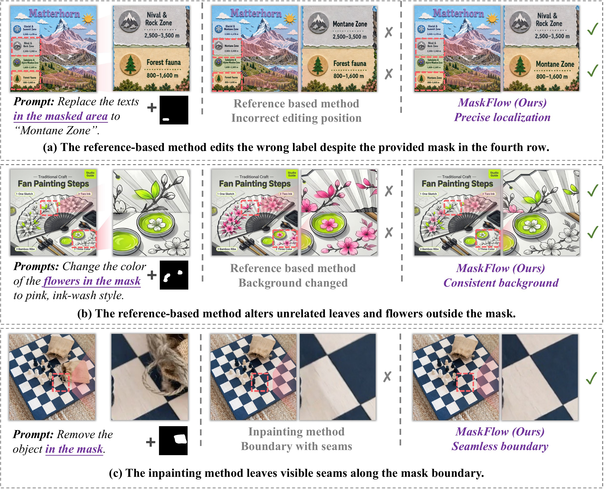
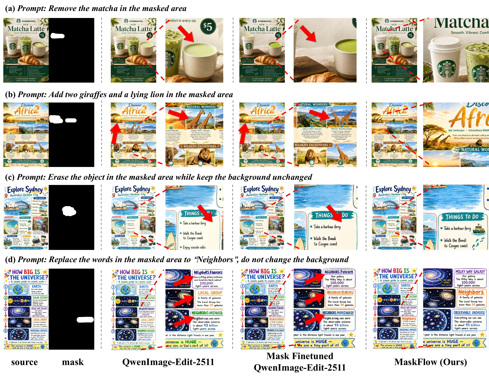

# 🌊 MaskFlow: Precise, Consistent and Seamless Regional Image Editing

<p align="center">
  <a href="https://reychiaro.github.io/MaskFlow"></a>
  <a href="https://arxiv.org/abs/2608.06929"></a>
  <a href="https://github.com/ReyChiaro/MaskFlow"></a>
  <a href="https://huggingface.co/ReyChiaro/MaskFlow"></a>
  <a href="https://huggingface.co/datasets/ReyChiaro/MaskFlow"></a>
  <a href="https://github.com/ModelTC/LightX2V"></a>
</p>

> ## Overview
> 🌊 <u>**Models**</u>: This repository is the official implementation for paper "MaskFlow: Precise, Consistent and Seamless Regional Image Editing", including:
> - Pipelines
> - Schedulers
> - DataModule
> - Trainers
> - Evaluators
> 
> 🎨 <u>**Dataset**</u>: The dataset is available on [🤗 Hugging Face](https://huggingface.co/datasets/ReyChiaro/MaskFlow).
>
> 🩵 <u>**Demo (Coming soon)**</u>: MaskFlow is integrated into [LightX2V](https://github.com/ModelTC/LightX2V) for an accessible inference workflow.
>
> ⭐️ **Please leave your star if these can help you to create attractive artworks** ⭐️

## Introduction

MaskFlow is a mask-aware framework for precise regional image editing. Given a source image, a spatial mask, and a text instruction, it edits the selected region while preserving the surrounding content. Its localized generation process and Soft-Poisson refinement improve regional control, background consistency, and boundary quality.

## Quick Start

### 1. Set up the environment

MaskFlow requires Python 3.12 or later. An NVIDIA GPU is recommended for inference.

```bash
git clone https://github.com/ReyChiaro/MaskFlow.git
cd MaskFlow

# Install uv if it is not already available.
python -m pip install uv

# Reproduce the locked Python 3.12 environment.
uv python install 3.12
uv sync
```

<details>
<summary>Alternative installation with venv and pip</summary>

```bash
python3.12 -m venv .venv
source .venv/bin/activate
python -m pip install --upgrade pip
python -m pip install -e .
```

Install a PyTorch build compatible with your CUDA environment if the automatically resolved build does not match your system.

</details>

### 2. Prepare the inputs

Prepare a source image and a spatially aligned mask. White pixels in the mask indicate the region to edit; black pixels indicate the region to preserve. Download the MaskFlow LoRA weights and provide their local path with `--lora-path`.

### 3. Run single-image inference

```bash
uv run python inference.py \
  --pretrained-model Qwen/Qwen-Image-Edit-2511 \
  --lora-path /path/to/maskflow-lora \
  --source /path/to/source.png \
  --mask /path/to/mask.png \
  --prompt "Replace the masked object with a red ceramic vase." \
  --output outputs/result.png
```

The output directory is created automatically. Omit `--lora-path` only when intentionally running the base model without the MaskFlow adapter.

<details>
<summary><strong>Command-line options</strong></summary>

Boolean options accept `true`/`false`, `1`/`0`, `yes`/`no`, `y`/`n`, or `on`/`off`.

#### Model

| Option | Default | Description |
|---|---:|---|
| `--pipeline` | `qwenimage_mask_flow` | Pipeline to run. MaskFlow aliases include `maskflow` and `qwenimage_mask_flow`; base editor aliases are also supported. |
| `--pretrained-model` | required | Local path or Hugging Face ID of the base Qwen-Image-Edit model. |
| `--lora-path` | `None` | Local directory or file containing the optional safetensors LoRA adapter. |
| `--adapter-name` | `maskflow` | Name assigned to the loaded LoRA adapter. |

#### Inputs and outputs

| Option | Default | Description |
|---|---:|---|
| `--source` | required | Path to the source RGB image. |
| `--mask` | required | Path to the mask image; white pixels are edited. |
| `--prompt` | required | Text instruction describing the desired edit. |
| `--negative-prompt` | empty | Optional negative prompt used for classifier-free guidance. |
| `--output` | required | Destination path for the edited image. |

#### Inference

| Option | Default | Description |
|---|---:|---|
| `--device` | automatic | Torch device such as `cuda:0` or `cpu`; automatically selects CUDA when available. |
| `--dtype` | `bf16` | Compute dtype: `bf16`, `fp16`, or `fp32` and their long-form aliases. |
| `--seed` | `42` | Random seed for reproducible inference. |
| `--num-inference-steps` | `50` | Number of denoising steps. |
| `--text-cfg-scale` | `1.0` | Text classifier-free guidance scale. |
| `--mask-cfg-scale` | `1.0` | Mask classifier-free guidance scale. |
| `--mask-threshold` | `0.5` | Threshold used to binarize the mask; use a negative value to keep a soft mask. |
| `--save-debug` | off | Also save intermediate mask, edge, and output tensors beside the result. |

#### Mask-aware editing

| Option | Default | Description |
|---|---:|---|
| `--mask-dilation-kernel` | `25` | Kernel size used to dilate the edit mask. |
| `--mask-blur-kernel` | `25` | Kernel size used to blur the mask. |
| `--mask-blur-sigma` | `25` | Gaussian sigma used for mask smoothing. |
| `--mask-edge-width` | `50` | Width of the mask boundary region. |
| `--enable-vae-mask-encoding` | `true` | Inject the mask during VAE encoding. |
| `--cfg-type` | `condition_weighted` | Mask CFG formulation: `progressive` or `condition_weighted`. |
| `--mask-cfg-null-type` | `full_one` | Null-mask representation: `full_one` or `null`. |
| `--enable-mask-cfg-gating` | `false` | Gate the mask CFG residual with mask latents. |
| `--enable-masked-loss` | `true` | Enable the mask-aware objective setting used by the pipeline. |
| `--enable-pixel-blend` | `true` | Blend preserved pixels directly from the source image. |
| `--enable-local-denoise-infer` | `false` | Enable local denoising during inference. |
| `--local-denoise-start` | `0.0` | Start of the normalized local-denoising interval. |
| `--local-denoise-end` | `1.0` | End of the normalized local-denoising interval. |

#### Soft-Poisson refinement

| Option | Default | Description |
|---|---:|---|
| `--enable-poisson-infer` | `true` | Enable Soft-Poisson refinement during inference. |
| `--poisson-start` | `0.0` | Start of the normalized refinement interval. |
| `--poisson-end` | `1.0` | End of the normalized refinement interval. |
| `--poisson-lambda-e` | `1.0` | Weight of the edit-region term. |
| `--poisson-lambda-s` | `1.0` | Weight of the source-consistency term. |
| `--poisson-num-iter` | `50` | Number of Soft-Poisson optimization iterations. |
| `--poisson-momentum` | `0.1` | Momentum used by the refinement update. |

#### Timestep scheduler

| Option | Default | Description |
|---|---:|---|
| `--weighting-scheme` | `logit_normal` | Timestep weighting scheme: `logit_normal` or `mode`. |
| `--logit-normal-mean` | `0.0` | Mean of the logit-normal timestep distribution. |
| `--logit-normal-std` | `1.0` | Standard deviation of the logit-normal timestep distribution. |
| `--mode-scale` | `1.29` | Scale used by the mode weighting scheme. |
| `--base-image-seq-len` | `256` | Base image sequence length used for timestep shifting. |
| `--base-shift` | `0.5` | Shift associated with the base sequence length. |
| `--max-image-seq-len` | `8192` | Maximum image sequence length used for timestep shifting. |
| `--max-shift` | `0.9` | Shift associated with the maximum sequence length. |
| `--shift` | `1.0` | Fixed timestep shift when dynamic shifting is disabled. |
| `--shift-power` | `1` | Exponent applied by the timestep-shift schedule. |
| `--time-shift-type` | `exponential` | Dynamic shift interpolation: `exponential` or `linear`. |
| `--use-dynamic-shifting` | `true` | Adapt the timestep shift to the image sequence length. |
| `--unmask-with` | `noisy_source` | Content used outside the mask: `target`, `source`, `noisy_target`, or `noisy_source`. |

</details>


## Visualization

MaskFlow supports a diverse range of mask-guided image editing tasks. The comparisons below show that, relative to other models, MaskFlow localizes edits more precisely while better preserving the surrounding content. It also produces smoother transitions between edited and preserved regions, resulting in higher visual fidelity.



MaskFlow is also well suited to applications such as infographic editing, where the target location can be difficult to specify through language alone. Spatial masks provide direct and intuitive control, making the method practical for real-world editing workflows.




## Distribution Matching Distillation

To improve efficiency for practical deployment, we apply Distribution Matching Distillation (DMD) and provide an accelerated variant that completes generation in only eight inference steps.

## Citation

```bibtex
@misc{xu2026maskflowpreciseconsistentseamless,
  title={MaskFlow: Precise, Consistent and Seamless Regional Image Editing},
  author={Rui Xu and Yang Yong and Shunzi Yang and Ruihao Gong and Chengtao Lv},
  year={2026},
  eprint={2608.06929},
  archivePrefix={arXiv},
  primaryClass={cs.CV},
  url={https://arxiv.org/abs/2608.06929},
}
```
